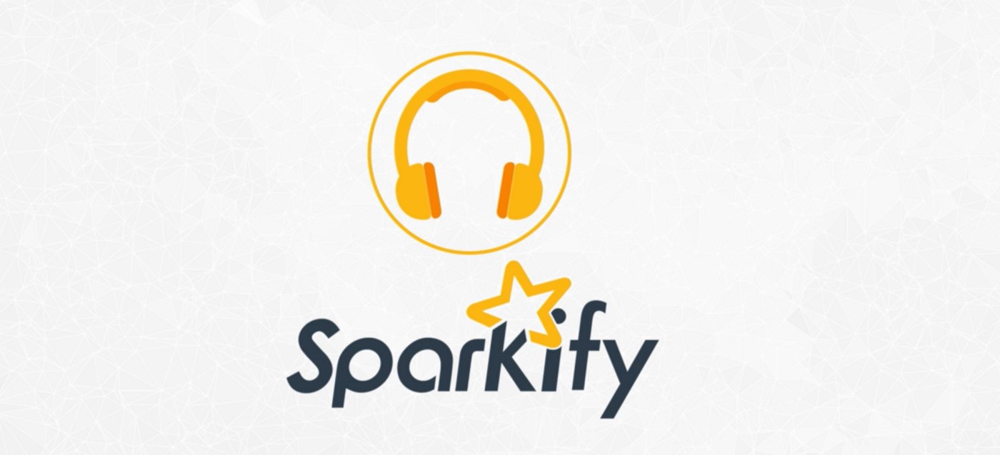
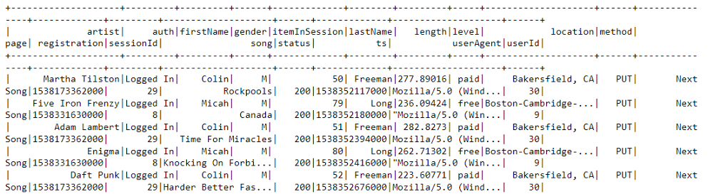
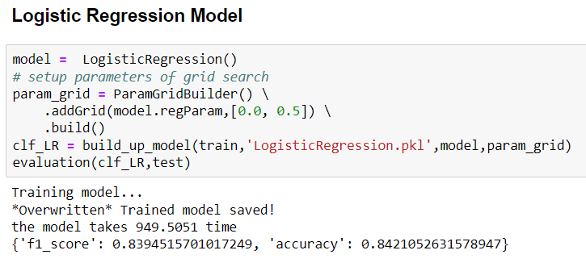

# Customer_Churn_with_PySpark

## Table of Contents
* Background
* File Descriptions
* Data
* Result
* Package Requirement
* Licensing, Authors, Acknowledgements

## Background
Streaming media companies such as Sportify and Tencent Music are easily to join or cancel service which results in customer churn (customer stop using the service or product). If we can predict in advance that the customer will churn, we can take actions such as sending coupons to retain the customer in advance. This project will use PySpark to predict customer churn. The following six steps are conducted to build up machine learning models with PySpark:
* Data Load
* Data Exploration
* Data Wrangling
* Labelling
* Data Gathering
* Modeling and Evaluation

The details of project can be found in my Medium(https://medium.com/@xujiang1993/build-a-machine-learning-model-with-pyspark-641cd70b7923).

## File Descriptions
Sparkify.ipynb contains the code of the project and mini_sparkify_event_data.json is the customer log.

## Data
The data of this work is provided by Udacity. Since this demo only work locally, I choose a relatively small data subset (128MB) for this work (the full dataset would be 12GB). The data used in this blog contains the records of the customer behaviors( e.g. Add Friend, Add to Playlist, Next Song, Roll Advert, Thubs Down and Thumbs up etc), the details of the songs, artists, login devices and events timestamps.An snapshot of the records is given below.

The snapshot of the dataEach row of the data represent an user operation log and the timestamps can help us to sort the events.

## Result
The best model is Logistic Regression Model which has achieved around 84% f1 score in customer churn prediction and it only took 15.8 mins for training and testing. Although this accuracy is still insuffient for the realistic deployment, 84% f1 score could help the company to identify some potential churned customer in advance. The next step is to get more computation power from a cloud platform to test more hyperparameters and features to further improve the f1 socre. If possible, an online experient could be designed to further test whether the classifier can bring profit for the business.

## Package Requirement
The code was developed on python 3. The following packages are required:
* pyspark

## Licensing, Authors, Acknowledgements
I would like to thank Udacity for this amazing project
